# SIEM Threat Detection with Wazuh

A fully deployed Wazuh SIEM stack used to monitor a Windows endpoint and detect a simulated real-world attack. Built on top of the [Cybersecurity Home Lab](#) as the underlying network.

## Overview

Deployed Wazuh (manager, indexer, dashboard) on Ubuntu Server, enrolled a Windows 11 endpoint as a monitored agent, and simulated an SMB credential brute-force attack from Kali Linux to validate detection end-to-end — from raw log, to correlated alert, to a documented incident response.

## Stack Setup

**Wazuh manager, indexer, and dashboard** all verified active on Ubuntu Server:

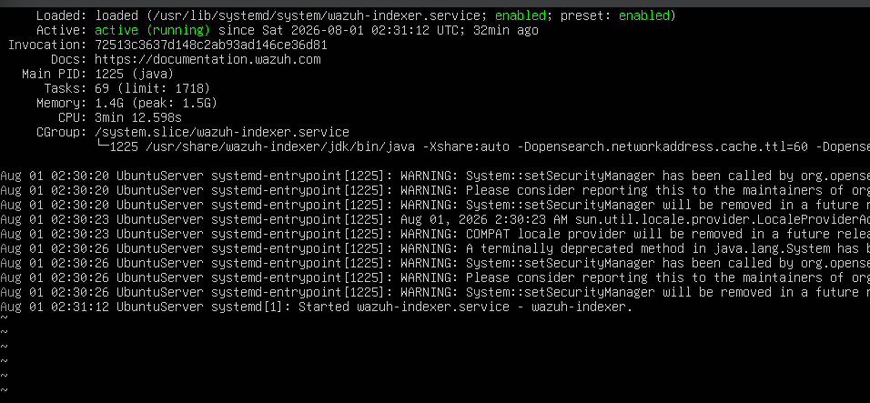
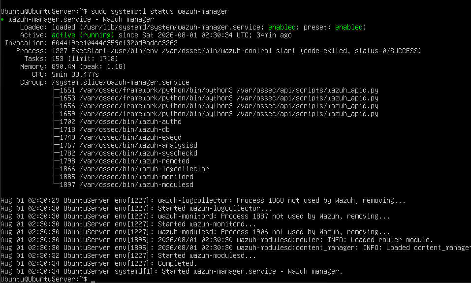
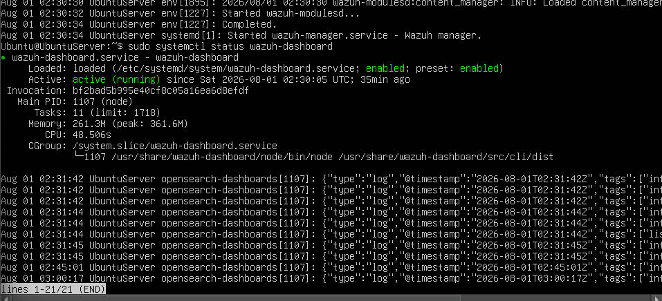
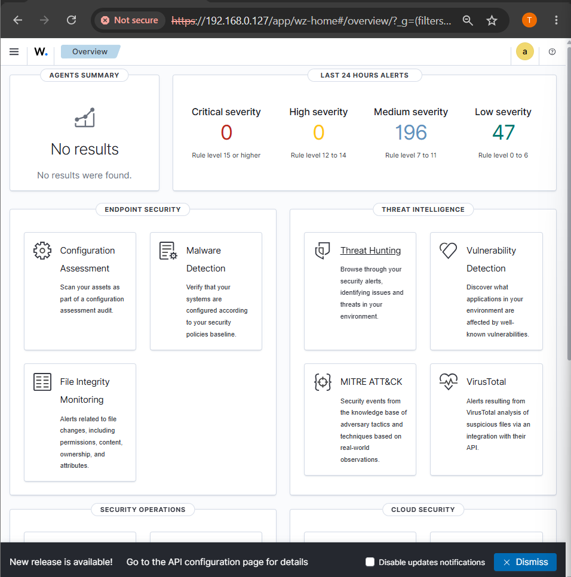

## Agent Deployment

The Windows 11 endpoint was enrolled using the dashboard's agent wizard:

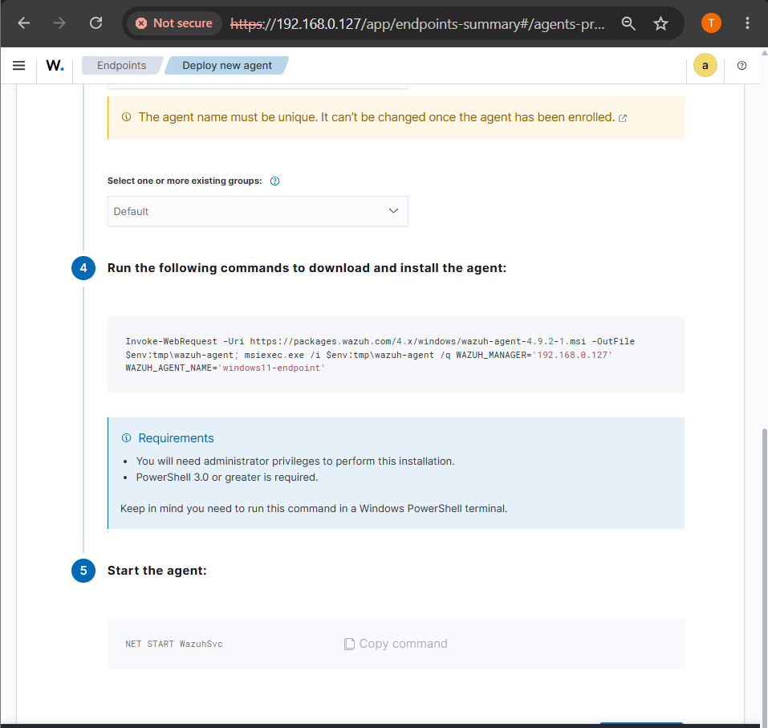
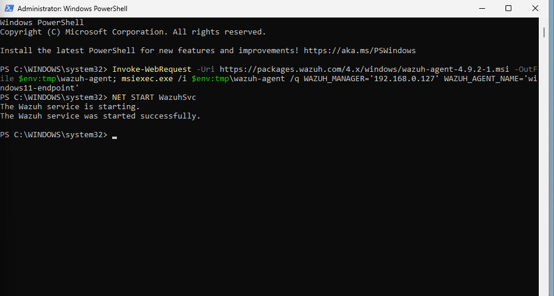
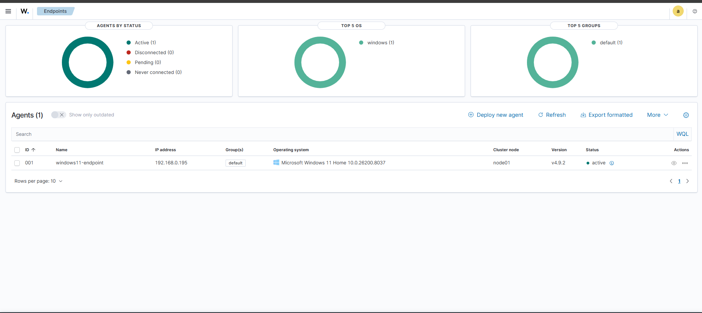
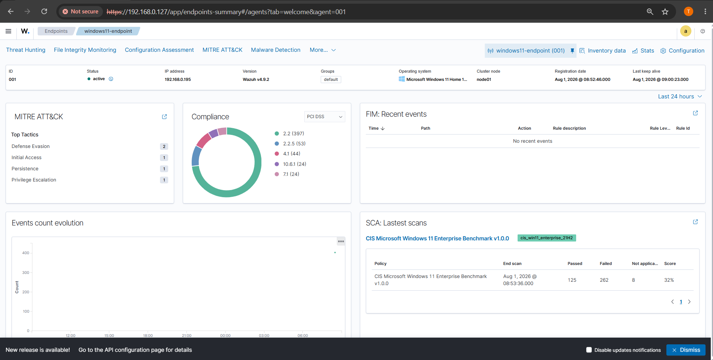

## File Integrity Monitoring

Configured realtime monitoring on a key directory and validated it with a controlled file create/modify/delete test:

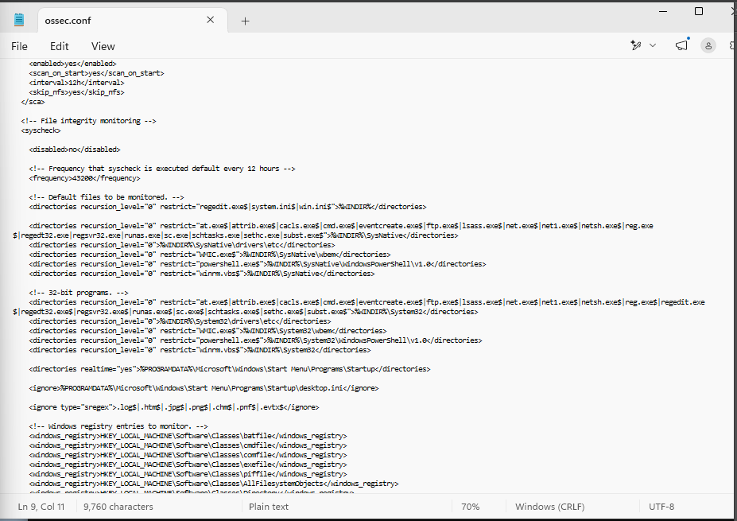
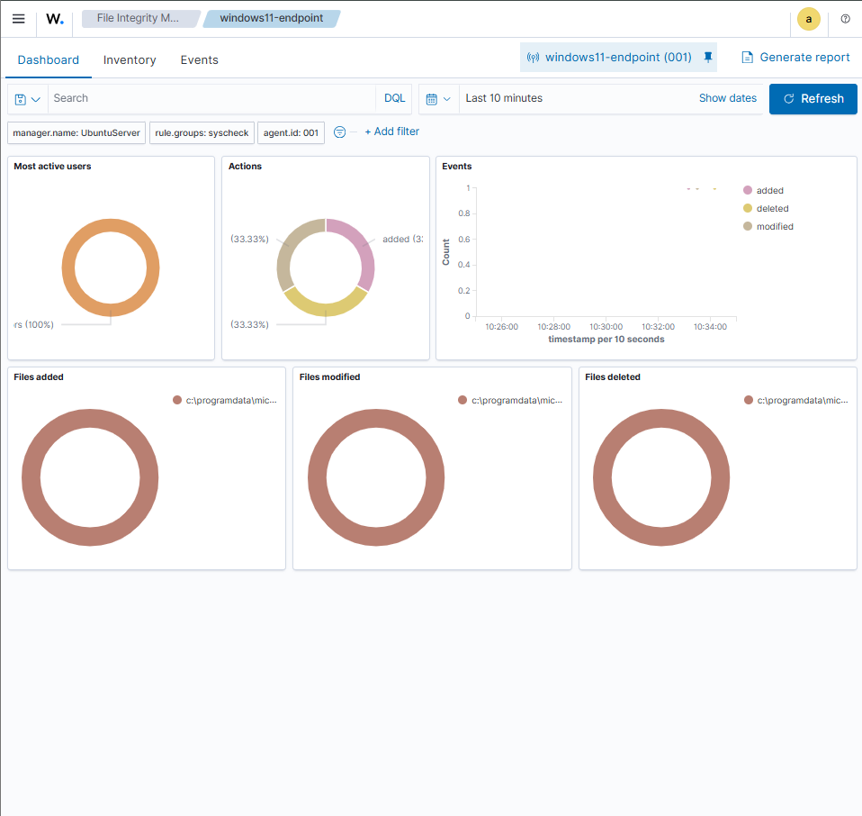

## Attack Simulation — SMB Brute-Force (MITRE ATT&CK T1110)

**Pre-attack verification** — confirmed SMB (port 445) reachable:

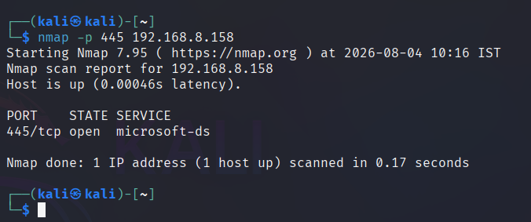

**Attack executed with NetExec**, generating real-time alerts in Threat Hunting:

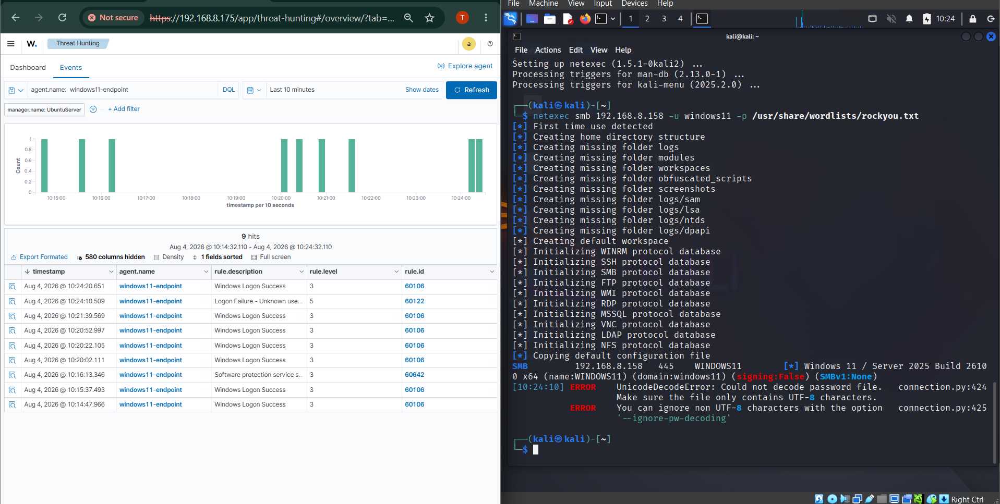

**Raw alert inspection** — forensic fields used for attribution:

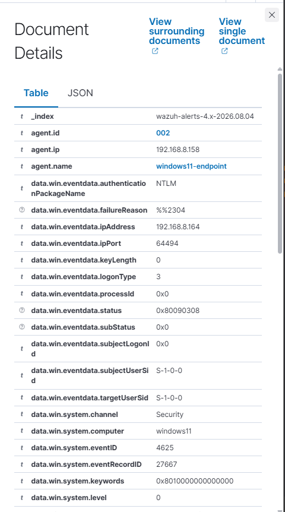

**Full alert escalation** — isolated failures → correlated multi-failure alert → account lockout:

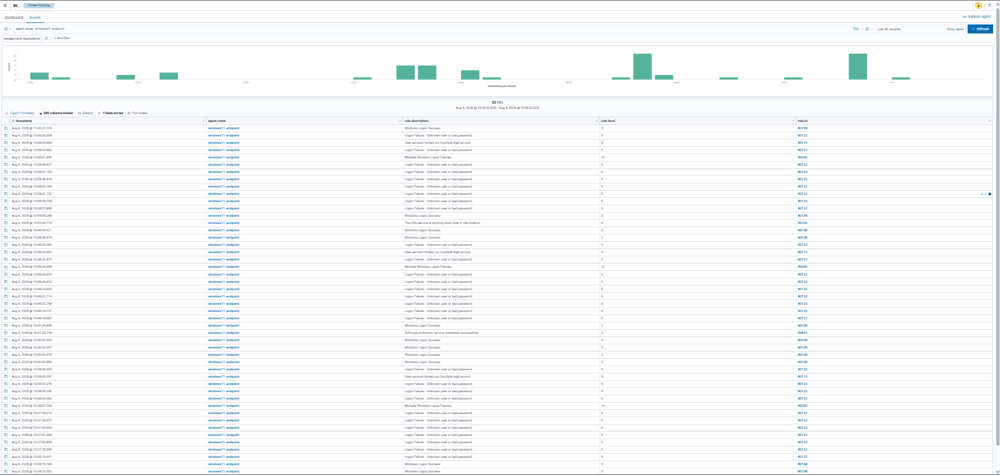

## Incident Summary

| Timestamp | Event | Rule ID | Level |
|---|---|---|---|
| 10:35:14.901 | First "Logon Failure – Unknown user or bad password" | 60122 | 5 |
| 10:37:26 – 10:37:59 | Repeated logon failures continue | 60122 | 5 |
| 10:38:01.028 | "Multiple Windows Logon Failures" correlation alert | 60204 | 10 |
| 10:38:07.276 | Account locked out (multiple login errors) | 60115 | 9 |

**Technical details:**
- Attacker source IP: `192.168.8.147` (Kali Linux)
- Target: `windows11-endpoint` (`192.168.8.158`)
- Authentication package: NTLM · Logon type: 3 (network) · Windows Event ID: 4625
- MITRE ATT&CK: T1110 (Brute Force), T1078 (Valid Accounts – attempted)

**Impact:** No unauthorized access achieved — Windows' native account lockout policy activated before any valid credential was found.

**Recommended response actions:**
- Isolate the source host pending investigation
- Reset the affected account's password as a precaution
- Enforce SMB signing to reduce attack surface
- Add a Wazuh active-response rule to auto-block a source IP after repeated failed SMB logons

## Configuration Choices

- Wazuh was chosen over a bare ELK Stack because it integrates log collection, OpenSearch-based indexing, and a Kibana-based dashboard with security-specific features (FIM, SCA, MITRE mapping) out of the box.
- SMB was used instead of RDP as the attack vector after discovering Windows 11 Home does not support inbound RDP hosting.
- NetExec was used instead of Hydra, whose SMB module failed to negotiate correctly with modern Windows SMB signing/dialect.

## Author

**Thavindu Danuja**
BSc (Hons) Information Technology – Cyber Security Specialization, SLIIT
ISC² Certified in Cybersecurity (CC)
